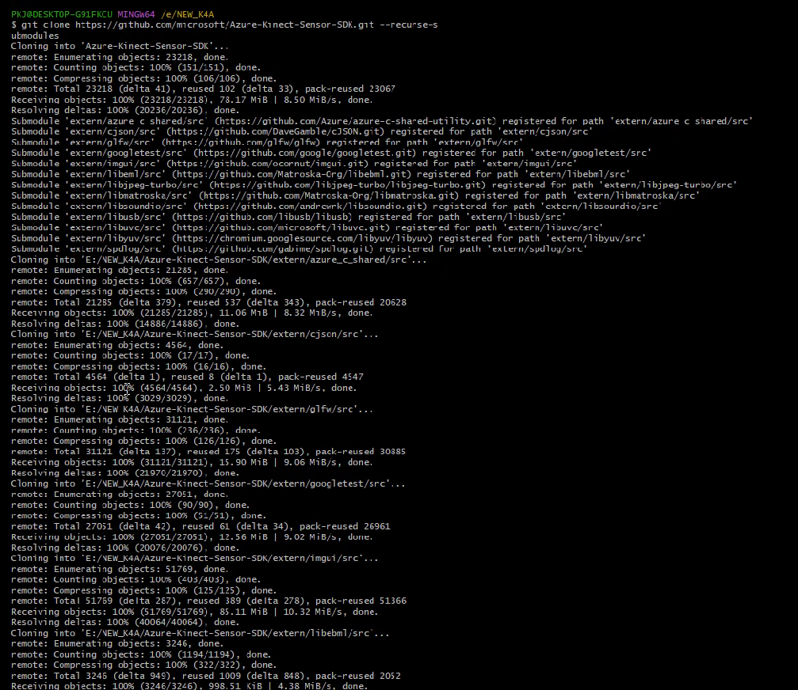
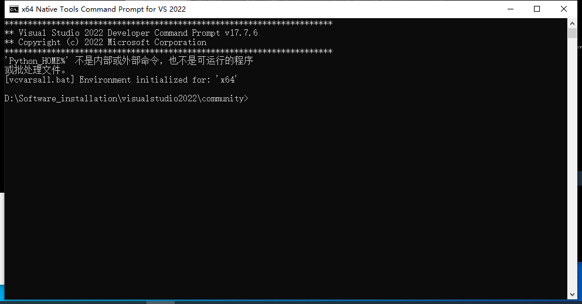
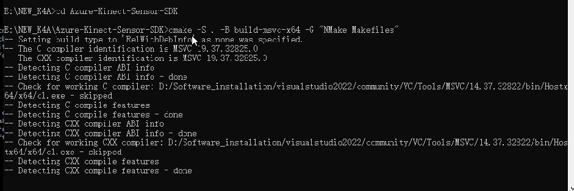
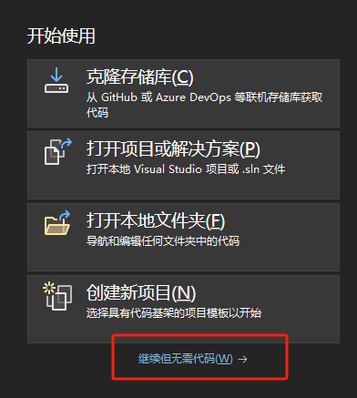
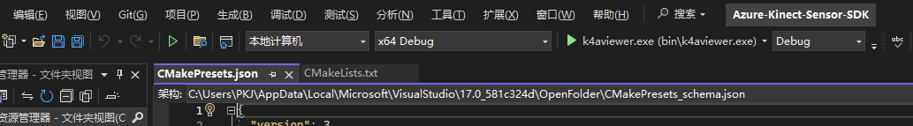

###### 一：开启真全局代理模式

**我用的是clash fow windows方式如下：**

1：点击Service Mode安装插件，会给你的电脑配个网卡模式。任务管理器可以看到多个clash以太网

2：安装好后Service Mode会有个绿色小球就代表装好了，点击开启

3：开启TUN Mode，然后命令行才能走国外的节点下

4:开启代理模式，开Mixin 或者 System Proxy都可以，然后proxies开rule，rule的话国内的软件会走国内的节点，国外的才会走国外的，这样运行国内的软件的话基本不会卡


###### 二：clone仓库以及相联系的子模块

1：选个地方开个git  Bash  或者   mkdir 文件夹名称然后cd 文件夹名称/路径

2: 下载Azure-Kinect-Sensor-SDK仓库以及相联系的子模块

```
git clone https://github.com/microsoft/Azure-Kinect-Sensor-SDK.git --recurse -s

// 后面加了 --recurse -s表示将该仓库相连的子模块一起下载，比如他用到的第三方库，glw3、libusb等
```

 下载过程：我们下载的是纯正的官方源码，这样防止后续依赖库的版本问题和配置出现缺少**相关静态/动态库文件**



###### 三：vs命令行用cmake构建项目

1：打开x64 Native Tools Command Prompt for VS2022工具



下载完后我们可以打开我们下载的目录，在Azure-Kinect-Sensor-SDK目录下有个叫CMakeLists.txt的文件，是cmake用来构建的指令，通过里面的指令可以编译源码为我们需要的lib、dll文件。具体的参考cmake教程


2：通过cmake构建项目

```
//  切换到刚刚下载好的目录
cd /d E:\NEW_K4A\Azure-Kinect-Sensor-SDK
```

```

cmake -S . -B build-msvc-x64 -G "NMake Makefiles"
```

**解释:**

- `cmake`: CMake命令行工具，用于生成项目的构建系统。
- `-S .`: 指定CMake项目的源目录为当前目录(`.`)。
- `-B build-msvc-x64`: 指定生成的构建系统文件和中间构建文件的目录为`build-msvc-x64`。可以选择任何有效的目录名称。
- `-G "NMake Makefiles"`: 指定构建系统的生成器为"NMake Makefiles"，这是用于Microsoft NMake工具的生成器。NMake是随Microsoft Visual Studio一起提供的构建工具。



3：生成k4aviewer

```
cmake --build-msvc-x64 --target help
cmake --build-msvc-x64 --target k4aviewer
//通过target help看下下载的目录
//发现有k4aviewer后开始构建生成（build）软件，同类这时候也可以生成Azure-Kinect-Sensor-SDK目录下的其他文件夹（软件）
```

4：编译完成，生成了exe文件

```
E:\NEW_K4A\Azure-Kinect-Sensor-SDK\build-msvc-x64\bin\k4aviewer.exe
// 启动exe文件即可打开软件
```

​		打开exe后发现连接相机有问题，缺少depthengine_2_0.dll文件，去github仓库发现他不是开源的，是要下载Azure Kinect Viewer v1.4.1后才附带的
我之前下载了这个，所以在他目录下找到depthengine_2_0.dll文件复制到exe目录下


###### 四：VS中构建开发

1：用vs打开Azure-Kinect-Sensor-SDK目录下的Cmakelists.txt文件（不用创建新项目）



然后点击菜单栏的文件---打开---CMake(M)；选择目录下的Cmakelists.txt文件即可


2： 编译器和启动像选择



选择windows/linux  x64 Debug-Ninja模式  (我这里构建过了，图不一样)

启动项选择k4aviewer.exe

点击k4aviewer.exe启动编译即可，顺利编译完就会弹出软件界面，完毕

**注意：**我的是vcpkg连接了vs的，并且之前用vcpkg下载过官方的库，所以我有depthengine_2_0.dll文件，编译时候他通过我的vcpkg找到了我之前的depthengine_2_0.dll文件复制粘贴到vs编译生成的目录下。如果没有这个文件的话就先去下载安装Azure Kinect Viewer v1.4.1，他会附带有。


###### 五：QT中构建开发